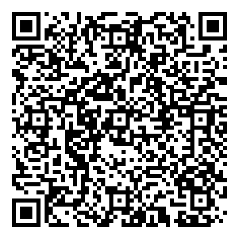
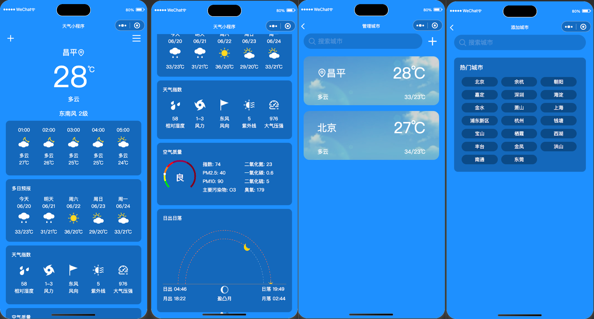

# mp-weather
天气预报微信小程序

## 说明
自己看官方文档写的第一个微信小程序,使用的大部分也是官方的组件，
    - UI：参考了华为的自带的天气预报页面
    - 组件: 大部分都是原生的，个别组件(搜索框，图标，等也用到了Tdesign小程序版)
    - 数据来源：使用的是和风天气的接口,文档: https://dev.qweather.com/docs/
    - 天气ICON：来自和风天气Icon(https://icons.qweather.com/)

## 存储
由于体验版的，没有使用数据库，个别数据(管理城市界面，首页城市列表)使用的是storage存储, 存储并不是永久的，在体验时，数据可能会有丢失的情况，如果个人使用，可以自己存储到数据库中。

## 在线体验

## 界面截图
